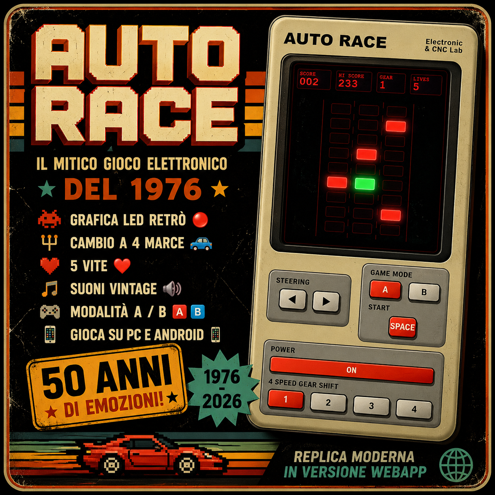
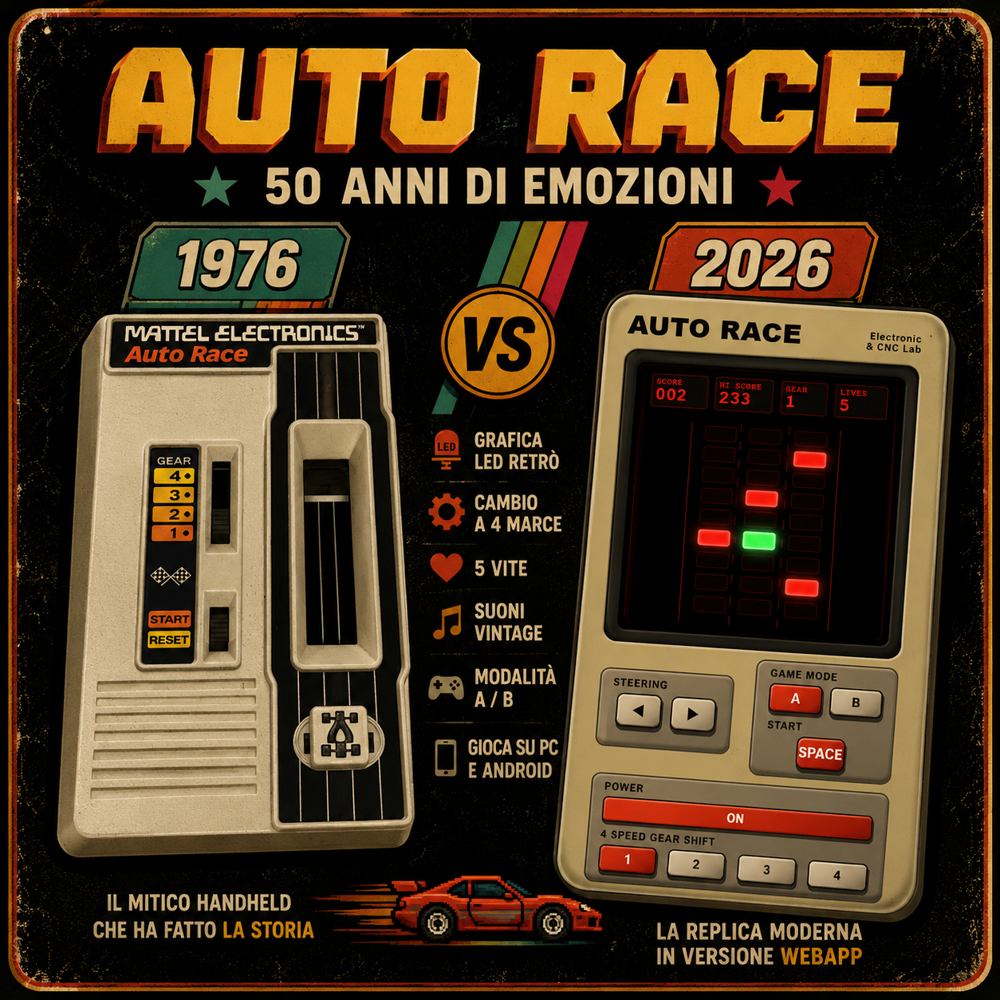
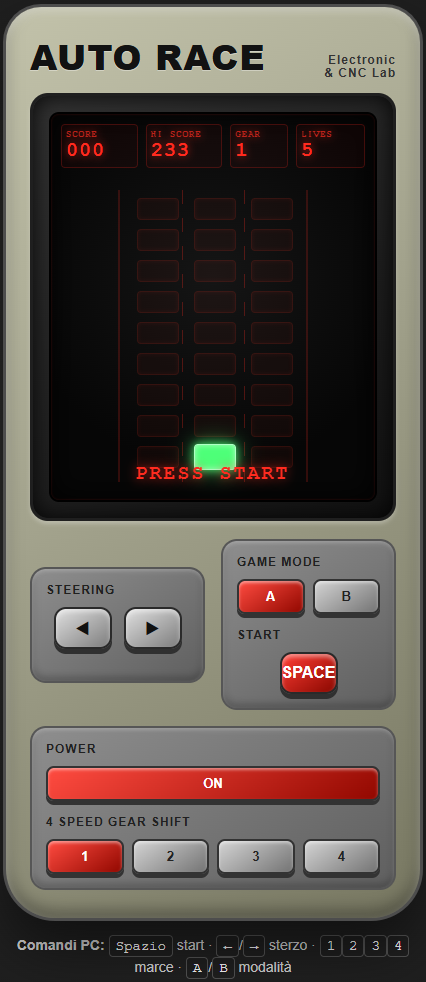
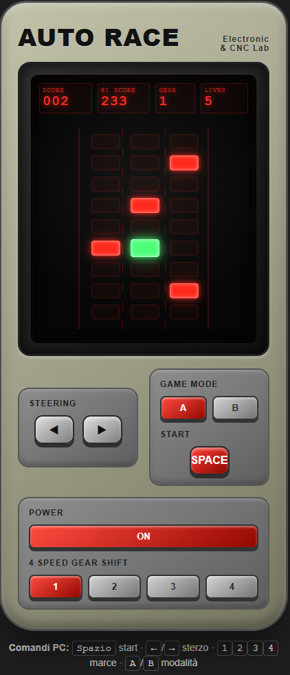

# AUTO RACE

Retro handheld-inspired web game inspired by 1980s electronic racing games.

Created by Giuseppe Romano - Electronic & CNC Lab.

## Features
- Vintage LED-style graphics
- 4-speed gearbox
- Mode A / Mode B
- 5 lives system
- Progressive difficulty
- Retro sound effects
- Touch support for Android
- Single-file HTML version

## Controls

### PC
- Arrow keys → steering
- SPACE → start
- 1 2 3 4 → gears
- A / B → game mode

### Mobile
Touch controls available on-screen.

## Technologies
- HTML5
- CSS3
- Vanilla JavaScript
- Web Audio API

## Project Goals
Recreate the feeling of classic 1980s handheld electronic games directly in a browser.

## Future Improvements
- PWA Android version
- Better sound synthesis
- Additional game modes
- Online leaderboard
- Hardware version with ESP32

## License
MIT License

## Screenshots

## References
- `references/version-1/` (first version reference photos)
- `references/version-2/` (second version reference photos)

## Photo Credits
Reference photos provided by Giuseppe Romano (`romans3`):
- GitHub: https://github.com/romans3
